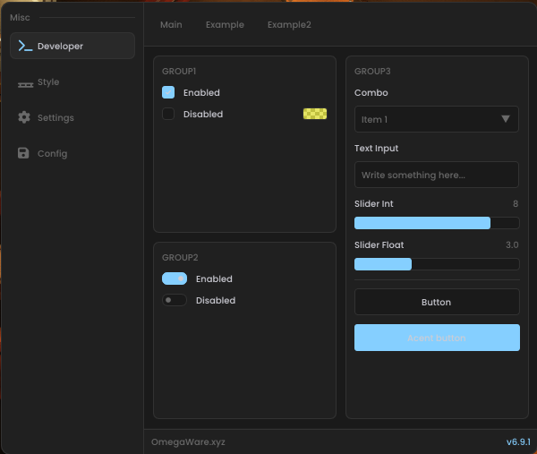
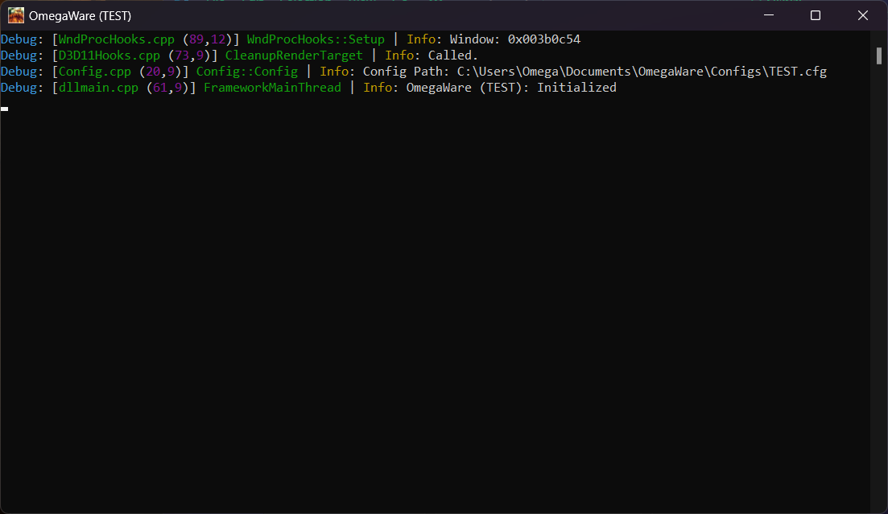

<div align="center">

# OmegaWare Framework


[](https://github.com/Omega172/OmegaWare-Framework/stargazers)
[](LICENSE)
[](https://github.com/Omega172/OmegaWare-Framework/actions)
[](https://github.com/Omega172/OmegaWare-Framework/issues)

</div>

---

## 📸 Screenshots

<div align="center">

### Menu Interface


### Developer Console


</div>

---

## 🎯 Features

- **Multi-Engine Support**: Unity, Unreal Engine, and generic game engines
- **Dynamic Renderer Detection**: Auto-detects D3D11/D3D12 rendering backends
- **Feature-Based Architecture**: Plugin-style system with auto-registration
- **Localization**: Built-in support for English, German, and Polish
- **Custom ImGui Widgets**: Professional UI components with animations
- **Config System**: Automatic save/load with JSON serialization
- **Compile-Time Hashing**: CRC64 string hashing for performance

---

##  The Internal Framework

The framework itself can be configured inside of `FrameworkConfig.h`

### ⚙️ FrameworkConfig.h

- **`FRAMEWORK_VERSION`**: Current version in `Major.Minor.Rework` format (e.g., `7.0.0`)
- **`FRAMEWORK_X64`**: Automatically set based on build configuration
- **`ENGINE_UNREAL | ENGINE_UNITY | ENGINE_OTHER`**: Select target engine type (only one can be enabled)
- **`FRAMEWORK_RENDER_DYNAMIC`**: Auto-detect rendering backend
- **`FRAMEWORK_RENDER_D3D11 | FRAMEWORK_RENDER_D3D12`**: Manually specify renderer

### 🎮 UnrealConfig.h

- **`SDK_IMPORTED`**: Reminder to import SDK before building
- **SDK Generation**: Use [Dumper-7](https://github.com/Omega172/Dumper-7) or [CheatGear](https://cheatgear.com/) (paid)

### 🔧 UnityConfig.h

- **`MONO_DLL`**: Mono DLL name (default: `mono-2.0-bdwgc.dll`)
- **`DEFAULT_ASSEMBLY_NAME`**: Path to Assembly-CSharp.dll

---

## 🚀 How to Build

This project is built using [Xmake](https://github.com/xmake-io/xmake). Use the [VS Code extension](https://marketplace.visualstudio.com/items?itemName=tboox.xmake-vscode) for the best experience.

### Clone Repository
### Clone Repository

```bash
# Clone with submodules (Git 2.13+)
git clone --recurse-submodules -j8 https://github.com/Omega172/OmegaWare-Framework.git

# Or for older Git versions
git clone --recursive https://github.com/Omega172/OmegaWare-Framework.git

# For already cloned repos
cd OmegaWare-Framework
git submodule update --init --recursive
```

### Build Commands

```bash
# Configure build mode
xmake config -m <debug|release> -a x64 -p windows

# Build project
xmake build

# Or use VS Code tasks (Ctrl+Shift+B)
# - xmake: Build (Debug)
# - xmake: Build (Release)
```

### Optional: Generate Visual Studio Project

```bash
xmake project -k vsxmake2022 -m "debug;release"
```

> **Note**: x86 and ARM builds are not officially supported and may require modifications.

---

## 📝 License

This project is licensed under the terms specified in [LICENSE](LICENSE).

## 🤝 Contributing

Contributions are welcome! Please feel free to submit issues and pull requests.

## ⭐ Support

If you find this project useful, consider giving it a star!
