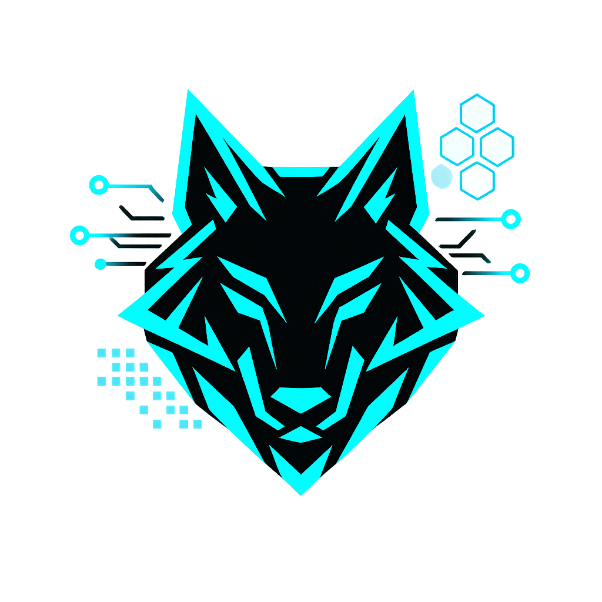

# OmegaWare Cheat Framework


<div align="center">

[](https://github.com/Omega172/OmegaWare-Framework/stargazers)<br>
[](LICENSE) [](https://github.com/Omega172/OmegaWare-Framework/actions) [](https://github.com/Omega172/OmegaWare-Framework/issues)

</div>

#  The Internal Framework
The framework itself can be configured inside of `FrameworkConfig.h`
 
## FrameworkConfig.h
`FRAMEWORK_VERSION`:  Is the current version of the framework in a Major.Minor.Rework format Ex. 6.8.6 which is the current version at the time of writing.

`FRAMEWORK_X64`: Is whether or not the framework is currently in a 64 bit configuration, this is set automatically.

  `FRAMEWORK_OTHER |	FRAMEWORK_UNREAL	| FRAMEWORK_UNITY`: These defines are used to set what interfaces and init functions the framework should based on the target engine type.

`FRAMEWORK_RENDER_DYNAMIC`: Is used to let the framework to attempt to decide what rendering backend should be hooked and used
`FRAMEWORK_RENDER_D3D11 | FRAMEWORK_RENDER_D3D12`: These defines are used to manually set what rendering backend to use

## UnrealConfig.h
`SDK_IMPORTED`: This is manually defined and is there to remind you to import an SDK before you attempt to build or add any features.
- To generate an SDK checkout [Dumper-7](https://github.com/Omega172/Dumper-7) or [CheatGear](https://cheatgear.com/) (Paid Service)

## UnityConfig.h
`MONO_DLL`: The name of the mono DLL the target application uses by default it is `mono-2.0-bdwgc.dll`
`DEFAULT_ASSEMBLY_NAME`: The path to the default Assemply-CSharp.dll, this should be changed and by default is `".\\GAME_NAME_Data\\Managed\\Assembly-CSharp.dll"`

# How to Build
This project it built using [Xmake](https://github.com/xmake-io/xmake). I recommend using [this](https://marketplace.visualstudio.com/items?itemName=tboox.xmake-vscode) extension for VSCode.
```bash
# Clone the repo and its submodules
git clone --recurse-submodules -j8 https://github.com/Omega172/OmegaWare-Framework.git # For git 2.13 and later
# or
git clone --recursive https://github.com/Omega172/OmegaWare-Framework.git # Older

# For already cloned repos
git clone https://github.com/Omega172/OmegaWare-Framework.git
cd Omegaware-Framework
git submodule update --init --recursive

# Here are the commands you will need to build the project
xmake -m <release | debug>

xmake -a <x64 | x86 | arm>

# Build all
xmake build 

# Individual
xmake build <Internal | FreeType | MinHook>

# If you want to generate a VisualStudio project (Not recommended)
xmake project -k vs -m "debug;release"
# Or
xmake project -k vsxmake2022 -m "debug;release"
```
